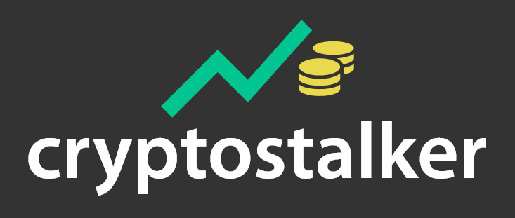
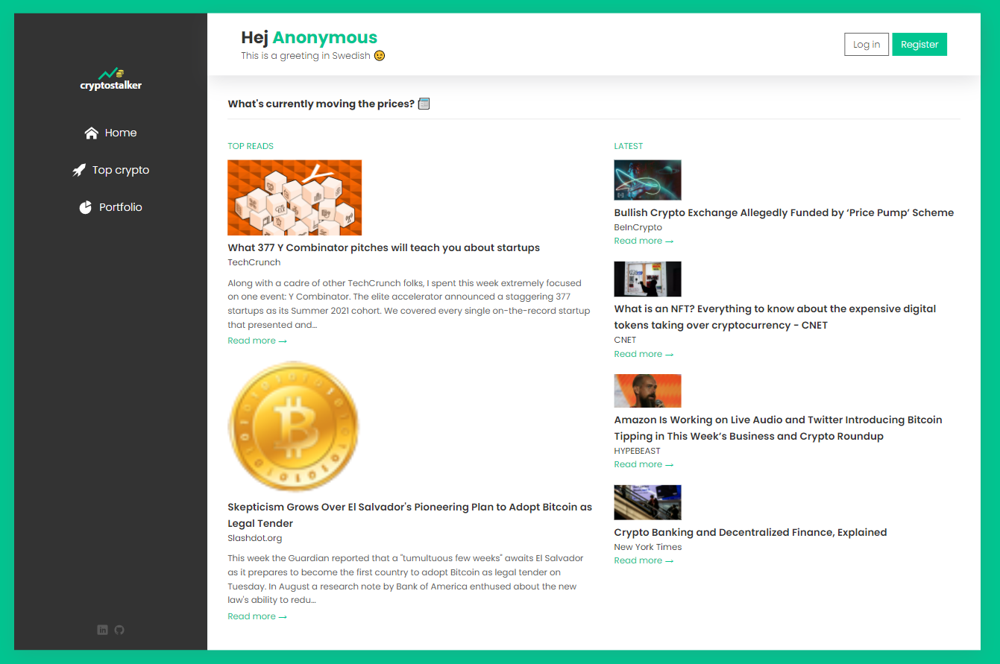
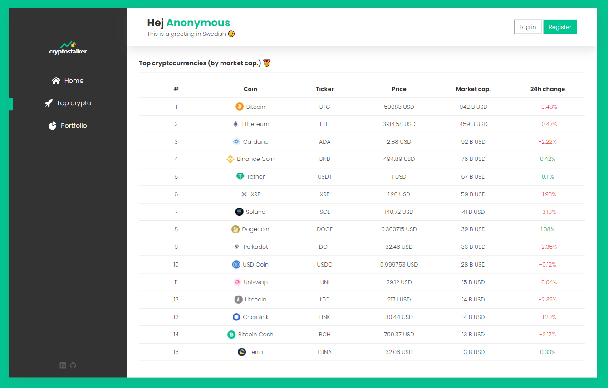
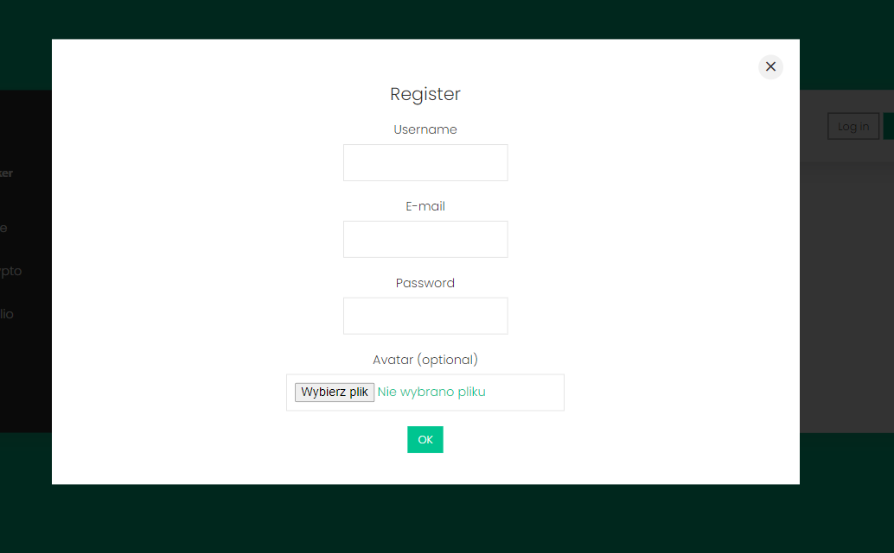
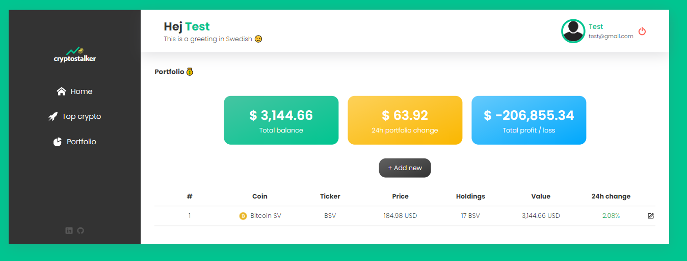
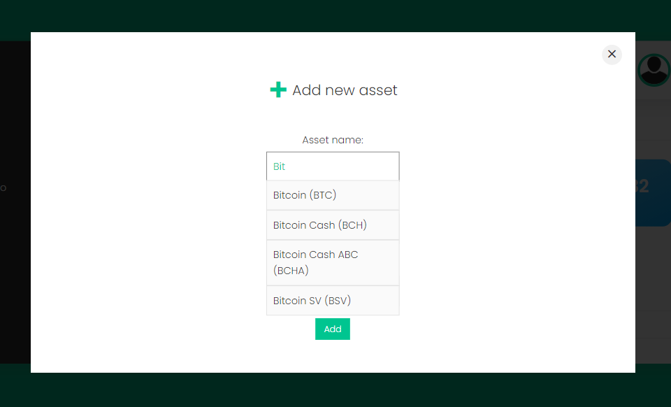
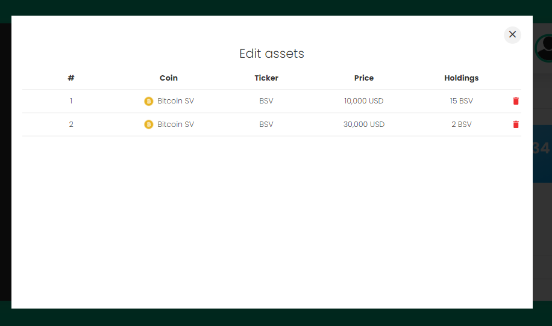

# cryptostalker

cryptostalker is a web app that allows you to check current news from the cryptocurrencies world, prices of the biggest cryptocurrencies (by market cap) as well as create a portfolio of your crypto assets. The project was initially written in Vanilla JavaScript and then rewritten in React during a front-end course at InfoShare Academy. The design of the project was created from scratch in Adobe XD

## Screenshots

The app will welcome you with a greeting available in 7 different languages and chosen randomly as well as 6 most popular news from the crypto world.

Top crypto section will show you 15 biggest cryptocurrencies by market capitalization.

To access portfolio you need to create an account and log in.

Portfolio contains all your cryptocurrencies and combines the same assets into 1 line. Dashboard will calculate total balance, 24h portfolio change as well as total / profit loss of all your assets as you add and remove your assets.

You can add new asset using **Add asset** button. Coingecko API will suggest a cryptocurrency name and symbol as you populate **Asset name** field.

You can remove desired elements of given cryptocurrency and the dashboard will reflect the changes automatically.

## Technologies

* React 17
* Firebase 8 (Firestore Database, Functions, Storage and Hosting)
* Sass (SCSS)

## Setup

To run this project, install it locally using `npm ci` and run command `npm start` which opens the app in the development mode.
Open [http://localhost:3000](http://localhost:3000) to view it in the browser.

## Further development plans

* Mobile / tablet version
* Add TypeScript
* Test components using Storybook
